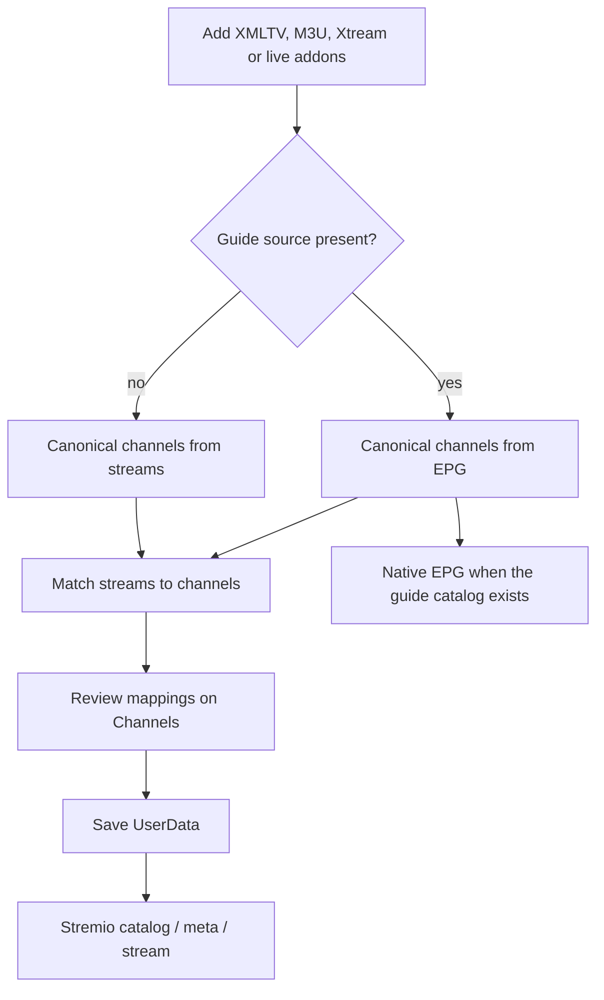

<p align="center">
  
</p>

<h1 align="center">AIOLiveTV</h1>

<p align="center">
  <strong>A unified Live TV aggregator for Stremio.</strong>
  <br />
  Combine XMLTV, M3U, Xtream and channel addons into a single addon, with or without Native EPG.
</p>

<p align="center">
  
  
  <a href="https://github.com/mrcanelas/aiolivetv/actions">
    
  </a>
  <a href="https://github.com/mrcanelas/aiolivetv">
    
  </a>
</p>

AIOLiveTV is in **public beta** (`0.1.0-beta`). Catalog, meta, stream and optional Native EPG work; expect breaking changes before 1.0. This is not a continuation of the AIOStreams 2.x version line.

---

## What is AIOLiveTV?

AIOLiveTV adapts the [AIOStreams](https://github.com/Viren070/AIOStreams) pipeline for live TV. It aggregates channels and streams from multiple sources, matches equivalents, and returns catalog, meta and stream resources over the standard Stremio protocol.

It can run in two modes:

- **With EPG** — XMLTV (or another guide source) defines the channels and the addon declares Native EPG (`behaviorHints.epgProvider`) only when a real guide exists.
- **Without EPG** — stream sources define the channels and equivalents are merged by matching.



---

## Sources

Everything is added from the existing **Addons** page:

| Source | Role |
| --- | --- |
| **XMLTV** | Channel metadata and programme guide |
| **M3U** | Live streams; also creates channels when there is no EPG |
| **Xtream Codes** | Live channels, optional EPG, and streams |
| **Vivo TV / Claro TV+** | Guide metadata from those providers |
| **Custom / community live addons** | Any Stremio Live TV manifest |

The **Channels** page lets you review mappings, reorder streams, and enable or disable channels. Changes stay in the draft until **Save**.

Docs: [Setup](packages/docs/content/docs/configuration/setup.mdx) · [XMLTV, M3U and Xtream](packages/docs/content/docs/guides/sources.mdx) · [Channels](packages/docs/content/docs/guides/channels.mdx)

---

## Running it

### Docker

```bash
git clone https://github.com/mrcanelas/aiolivetv.git
cd aiolivetv
cp .env.sample .env
# Set BASE_URL and SECRET_KEY (64-character hex)
docker compose up -d
```

Open `http://localhost:3000/stremio/configure`.

### Vercel

Use external PostgreSQL and Redis. In the project, set Framework Preset to **Container** and keep Root Directory at the repository root. Guide: [Deploy on Vercel](packages/docs/content/docs/getting-started/vercel.mdx).

### From source

Requires Node `>=24` and pnpm `>=11`.

```bash
pnpm install
pnpm build
pnpm start
```

---

## Credits

AIOLiveTV is an adaptation of [AIOStreams](https://github.com/Viren070/AIOStreams) by [Viren070](https://github.com/Viren070), and is licensed under the [GNU Affero General Public License v3.0](LICENSE).

## Disclaimer

AIOLiveTV aggregates metadata and channel URLs provided by the operator. It does not host or distribute media. Use of the configured sources is the responsibility of whoever runs the instance.
